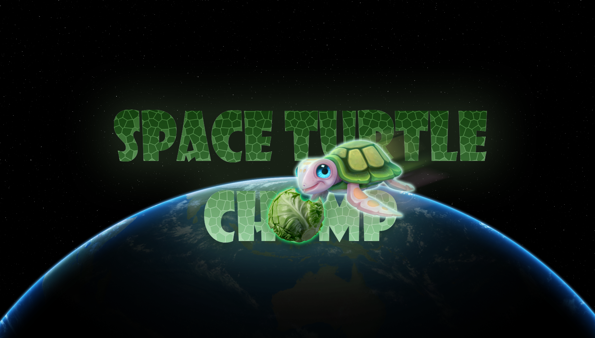

# Turtle Game: Space Turtle Chomp

## Overview
Space Turtle Chomp is an engaging and interactive game built using Python's Turtle Graphics library. Players control a turtle to collect food while competing against an AI opponent. The game features sound effects, a timer, and a scoring system, providing a fun and competitive experience.

## Features
- **Player Control**: Use the left and right arrow keys to navigate the turtle.
- **AI Opponent**: Compete against a randomly moving AI turtle that also collects food.
- **Food Collection**: Collect food items to increase your score. The player earns points for each food item collected.
- **Boundary Detection**: The game includes boundary checks to prevent turtles from moving off-screen, with sound effects triggered upon collision.
- **Sound Effects**: Enjoy immersive sound effects for collecting food and hitting boundaries, enhancing the gaming experience.
- **Timer**: The game is time-limited to 60 seconds, adding urgency and excitement to the gameplay.
- **Score Display**: The current score for both the player and the opponent is displayed on the screen, allowing for easy tracking of progress.
- **Game Over Screen**: At the end of the game, players are informed of their victory or defeat, with an option to restart the game.

## Technologies Used
- **Python**: The game is developed using Python, leveraging its Turtle Graphics library for rendering graphics and handling user input.
- **Winsound**: Utilised for playing sound effects during gameplay.

